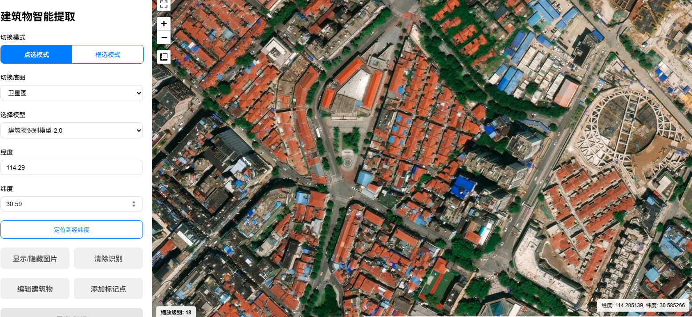

# Box2Buildings
基于深度学习的卫星影像建筑物智能识别与导出工具

**框选即得**：一个交互式 Web 应用，允许用户在地图（卫星底图）上框选任意区域，利用深度学习模型自动识别区域内的建筑物轮廓，并可将识别结果导出为 Shapefile (SHP)等 GIS 格式供下载使用。A building detection application rebuilt with Django and Vue 3

项目测试地址：[测试链接](http://118.25.148.18/)

# 目前正在重写项目，使用django+vue3
> 模型使用PyTorch,数据集搭嘎有8千多张图片和标注

